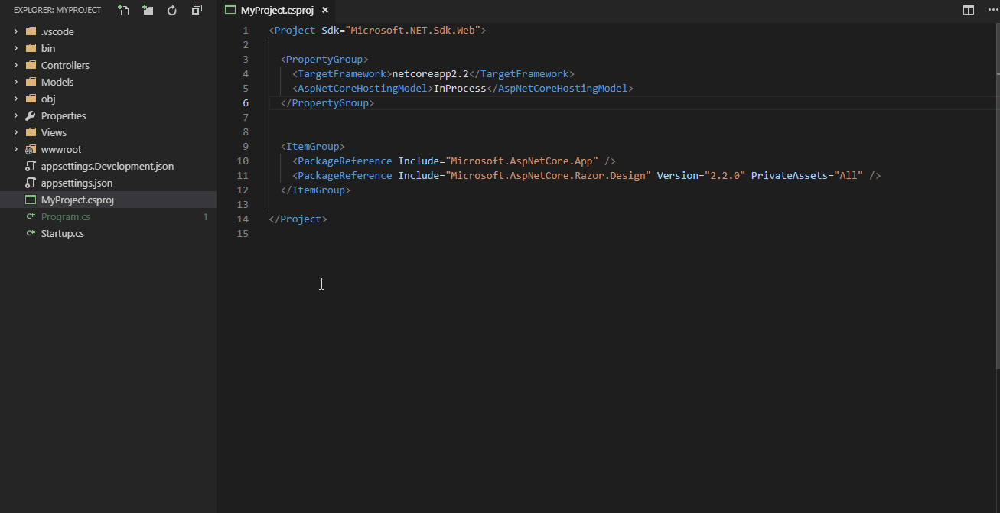

# .NET Core User Secrets

Right-click a .csproj file in the Explorer and select "Manage User Secrets" from the context menu to insert auto-generated UserSecretsId element and/or open associated secrets.json file.

## See how it works

